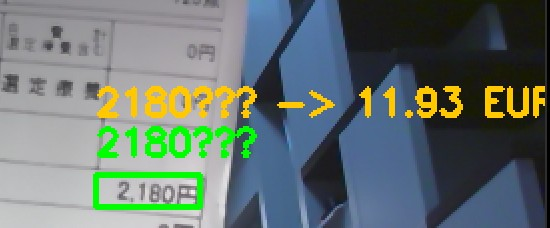

# Price Converter (OCR-Based)


## Overview

Price Converter is a Python application that detects prices from images or a live webcam feed using Optical Character Recognition (OCR), identifies the associated currency, and converts detected prices into a target currency.

This project was developed with an AI-native approach ([See Development Methodology](#development-methodology-ai-native-approach)) to explore computer vision, text processing, and API-based currency conversion in a practical context. The goal was to create a practical tool that could help travelers quickly understand foreign prices without manually converting each one.


## Features

- OCR-based text detection using EasyOCR
- Automatic price extraction with currency recognition
- Support for symbols and codes (€, $, £, ¥, EUR, USD, GBP, JPY, 円)
- Optional default currency and manual currency override
- Real-time webcam mode
- Static image processing mode
- Noise filtering (confidence threshold, minimum price value)
- Basic OCR error correction for common currency misreads


## How It Works

1. The application captures an image (from a file or webcam).
2. EasyOCR detects text regions and returns bounding boxes with confidence scores.
3. A custom price parser extracts numeric values using regular expressions and associates them with detected currencies.
4. Prices are converted using live exchange rates via **forex-python**.
5. The converted values are displayed on the image alongside the original price.


## Project Structure

This project follows a production-grade directory structure, separating source code (`src/`), unit tests (`tests/`), and infrastructure configuration (`.github/`, `Dockerfile`).

```text
.
├── .github/workflows/
│   └── test.yml             # CI/CD Pipeline (Runs tests on every push)
├── src/
│   ├── webcam.py            # Entry point: Real-time video processing
│   ├── static_image.py      # Entry point: Static image CLI tool
│   ├── currency.py          # Currency API handling & rate caching
│   ├── ocr.py               # EasyOCR model wrapper
│   ├── price_parser.py      # Regex logic for extracting prices
│   └── text_normalizer.py   # Post-processing for OCR error correction
├── tests/
│   ├── test_currency.py     # API mocking tests
│   ├── test_price_parser.py # Regex logic unit tests
│   └── test_text_normalizer.py
├── images/                  # Test dataset (Menus, receipts, etc.)
├── Dockerfile               # Production container configuration
├── Makefile                 # Developer shortcuts (make run, make test)
└── requirements.txt         # Python dependencies
```

## Installation

Clone the repository and install dependencies:

```bash
pip install -r requirements.txt
```


## Usage

Run static image mode:

```bash
python static_image.py
```


Run webcam mode:

```bash
python webcam.py
```


In webcam mode:

- Press **t** to trigger OCR and conversion

- Press **c** to clear results

- Press **q** to quit


## Development & Testing

This project includes a suite of unit tests to ensure accurate price parsing and currency conversion logic.

To run the tests:

```bash
# Run all tests via Makefile
make test

# Or using unittest directly
python -m unittest discover tests
```

## Expected Outputs

- Below is an example of the webcam mode detecting a price in JPY and converting it to EUR in real time.




- Example output from static_image.py converting JPY prices to EUR using a sample image.


## Learning Goals

This project was developed to:
- Understand how OCR systems work in practice
- Implement pattern-based text parsing using regular expressions
- **Implement Unit Testing (unittest) and mocking external APIs**
- **Set up CI/CD pipelines using GitHub Actions**
- Structure a modular Python application


## Known Limitations

- OCR accuracy depends heavily on lighting, camera quality, and text clarity.
- Exchange rates are retrieved at runtime and require an internet connection.
- Complex price formats (e.g., thousands separators in different locales) may not always be parsed correctly.
- Real-time processing is not continuous by default in webcam mode (manual trigger required).
- The application is optimized for learning purposes, not production deployment.


## Development Methodology: AI-Native Approach

- **Role of AI:** Acts as the primary implementation engine. I utilized LLMs to generate the main core syntax, including OCR integration and API handling.
- **Role of Engineer:** Focused on **Architecture, Integration, and Verification**. My primary responsibilities were:
    - Designing the project structure.
    - Debugging integration issues (e.g., fixing `unittest.mock` pathing errors).
    - Setting up the CI/CD pipeline to ensure the AI-generated code remains stable.

This approach aligns with the philosophy of **"Maximizing Output with Technology"**, allowing a single developer to build, test, and deploy a full-stack application in a fraction of the traditional time. It allowed me to focus my energy on the architectural decisions and the specific OCR logic, while automating the "boilerplate" engineering tasks.


## License

This project is licensed under the MIT License.
